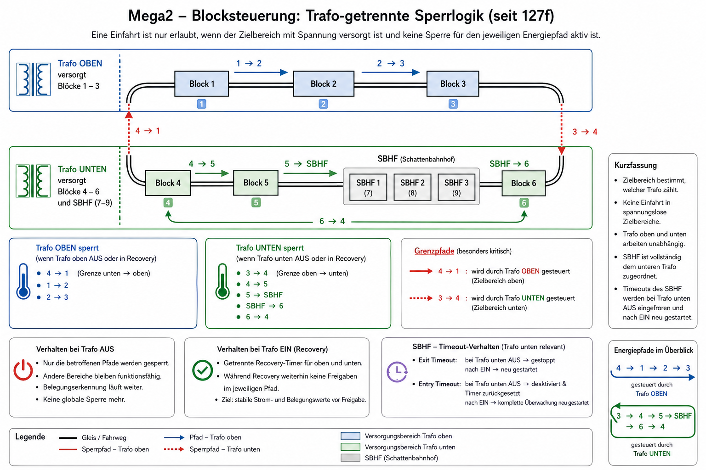

# Blocksteuerung -- Systemdokumentation

## Überblick

Die Blocksteuerung läuft auf Mega2 und übernimmt:

- Belegungserkennung
- Freigabelogik (Grant)
- Sicherheitslogik
- Trafo-abhängige Sperrlogik
- Integration SBHF

---

## Belegung

occupied = contactActive OR currentAboveThreshold

---

## Trafo-getrennte Sperrlogik (seit 127f)

Die Freigabelogik ist nicht mehr global, sondern nach Energiepfaden getrennt.

### Trafo-Zuordnung

#### 🔵 Trafo oben (Blöcke 1–3)

Sperrt folgende Einfahrten:

- 4 → 1
- 1 → 2
- 2 → 3

#### 🟢 Trafo unten (Blöcke 4–6 + SBHF)

Sperrt folgende Einfahrten:

- 3 → 4
- 4 → 5
- 5 → SBHF
- SBHF → 6
- 6 → 4

---

## Wichtiger Grundsatz

Eine Einfahrt ist nur erlaubt, wenn:

- der Zielbereich mit Spannung versorgt ist
- keine Trafo-Sperre für diesen Pfad aktiv ist

Insbesondere:

- 4 → 1 wird durch Trafo oben bestimmt
- 3 → 4 wird durch Trafo unten bestimmt

---

## Verhalten bei Trafo AUS

Bei Unterschreiten der AUS-Schwelle:

- nur die betroffenen Pfade werden gesperrt
- andere Bereiche bleiben funktionsfähig
- Belegungserkennung läuft weiter

---

## Verhalten bei Trafo EIN (Recovery)

Beim Wiedereinschalten:

- getrennte Recovery-Zeiten für oben und unten
- während Recovery:
  - weiterhin keine Freigaben im jeweiligen Pfad

Ziel:

- stabile Strom- und Belegungswerte vor Freigaben

---

## SBHF-Integration

Der SBHF ist vollständig dem unteren Trafo zugeordnet.

### Wichtig:

- Trafo oben AUS beeinflusst SBHF nicht
- Trafo unten AUS blockiert SBHF-Fahrten korrekt

---

## Timeout-Verhalten SBHF (wichtig)

Bei Trafo unten AUS:

- Entry- und Exit-Timeouts werden:
  - gestoppt
  - zurückgesetzt

Nach Trafo unten EIN:

- Timeout startet neu
- keine Emergency durch Spannungsverlust

---

## Ziel

- keine Einfahrt in spannungslose Bereiche
- keine unnötigen globalen Sperren
- deterministische und nachvollziehbare Freigabelogik
- stabile SBHF-Integration

## Trafo-getrennte Sperrlogik

